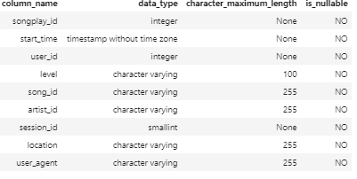

# Postgres Tutorial

Postgres Tutorial is collection of scripts that explains in simple steps about various ETL operations on a Postgres DB using Python. This tutorial also briefly explains about Data Warehousing concepts and its implementation in a star schema (Fact and Dimensions).
Following concepts have been covered in this tutorial
* Creation of Postgres DB
* Dropping tables (handling existence/non-existence)
* Creating tables (handling existence/non-existence). This also emphasize on constraints and its implementation.
* Normal and Bulk insertion into tables ensuring no violation of constraints.
* Joining of two tables for fetching some values.

     
## Installation

Hosting on Pip is in progress

## Usage

```python
import create_tables
import etl
import etl_bulk

```
* create_tables - This module deals with following cases.
 1) Creation of a Postgres DB.
 2) Dropping a table. If table exist then only it will be dropped or else nothing will be done.
 3) Creating tables. Creation of tables in a warehousing model (Fact and Dimensions). This also details out usage of constraints while creation of tables.

One Fact struture looks like as follows


* etl - This module emphasis on ETL (**E**xtract, **T**ransform & **L**oad) operation in Postgres DB using Python.        
1) Extract - Loading Json files into Python Pandas Dataframe is explained in quite a detail. Pandas.read_json() has been used to the loading.
e.g.

```python
df = pd.read_json(filepath, lines=True)
```

2) Transform - Transformation of a data is done in Python. Example have been shown to filter out of some column value. Also, transformation for changing numeric value to its corresponding timestamp value is also shown.
e.g.

```python
t = pd.to_datetime(df['ts'])    
```  

Examples have also been shown for selecting only few columns out of all.

```python
artist_data =   list(df[['artist_id', 'artist_name', 'artist_location',\
                             'artist_latitude','artist_longitude']].values[0])    
```

3) Load- Record by Record loading from Pandas dataframe to tables have been demonstrated in detail. This use postgres insert command for loading data.
e.g.

```python
for i, row in user_df.iterrows():
        cur.execute(user_table_insert, row)
```

* etl_bulk - This module emphasis on ETL (**E**xtract, **T**ransform & **L**oad (in bulk)) operation in Postgres DB using Python.        
1) Extract - Loading Json files into Python Pandas Dataframe is explained in quite a detail. Pandas.read_json() has been used to the loading.
e.g. 

```python
df = pd.read_json(filepath, lines=True)
```

2) Transform - Transformation of a data is done in Python. Example have been shown to filter out of some column value. Also, transformation for changing numeric value to its corresponding timestamp value is also shown.
e.g.

```python
t = pd.to_datetime(df['ts'])    
```  

Examples have also been shown for selecting only few columns out of all.

```python
artist_data =   list(df[['artist_id', 'artist_name', 'artist_location',\
                             'artist_latitude','artist_longitude']].values[0])    
```

3) Load- Bulk loading from file to tables have been demonstrated in detail. This use postgres copy command for loading data.
e.g.

```
copy time_tmp from '/home/workspace/time_tmp.csv' DELIMITER '~';    
```

Lookout for help on modules and functions for detailed usage.

## Contributing
Any suggestions are welcome. For major changes, please open an issue first to discuss what you would like to change.   

## License
Applied